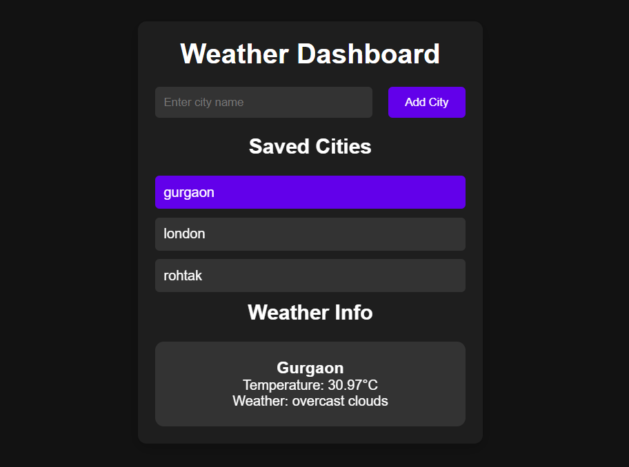

# 🌤️ Weather Dashboard

A simple Weather Dashboard web app built using **HTML, CSS, and JavaScript**, which allows users to add cities and view real-time weather using the **OpenWeatherMap API**. Cities are saved in **local storage** for quick access.

---

## 📸 Screenshot

<p align="center">
  
</p>

---

## 🚀 Features

- 🔍 Search and add any city to track weather
- ☁️ Real-time weather info from OpenWeatherMap API
- 💾 Saves cities in local storage
- 🧾 Simple and clean UI using vanilla HTML, CSS, JS
- 📱 Responsive Design 

---

## 🛠️ Installation

1. **Clone the repository**  
   ```bash
   git clone https://github.com/anuj-singal/weather-dashboard.git
   ```

2. **Navigate to the project folder**  
   ```bash
   cd weather-dashboard
   ```

3. **Open `index.html` in your browser**  
   - You can double-click the file  
   - Or use **Live Server** in VS Code

4. **Set your API Key**  
   Open `script.js` and replace the existing API key:
   ```js
   const API_KEY = "YOUR_API_KEY_HERE";
   ```
   🔑 Get your free API key from 👉 [OpenWeatherMap](https://openweathermap.org/api)

---

## ▶️ After Installation – How to Use

1. ✅ **Enter a City Name**  
   - Type a city like `London`, `New York`, or `Delhi` in the input field

2. ➕ **Click on "Add City"**  
   - The city gets saved using **Local Storage**

3. 🌦️ **Click a City from the List**  
   - See real-time weather details like:
     - Temperature (°C)
     - Weather description

4. 🔁 **Auto-saved**  
   - Your city list stays even after reloading the page

---

## 🧪 Tech Stack

- HTML5  
- CSS3  
- JavaScript (Vanilla)  
- OpenWeatherMap API  
- Local Storage API

---

## 🧑‍💻 Author

<p>
  <a href="https://github.com/anuj-singal" target="_blank">
    
  </a>
</p>
